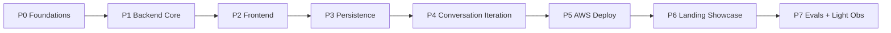

# AI Build Advisor — Phased Build Plan

> **Framing:** This is a **portfolio project** that may become a product. The plan optimizes for: building the full feature set (including the differentiating conversation iteration), shipping a polished showcase, and proving quality via evals. It deliberately defers commercial concerns (billing, marketing distribution, heavy analytics) until the project earns the right to become a product.

## Guiding Principles

- **Build the whole thing locally first.** Including the conversation iteration layer. Local feedback loops are 100x faster than deploy-and-test. Phases 0-4 are pure local development.
- **Guardrails baked in from Phase 0**, not bolted on at the end. Every phase below has a "Guardrails" subsection.
- **Deploy once you have something to show.** Phase 5 (deploy) only after the full product works locally.
- **Ship the landing as a project showcase, not a SaaS funnel.** Phase 6 emphasizes craft, story, and "how I built this" — not conversion optimization. There is no urgency around waitlists, distribution, or paid tiers for a portfolio project.
- **Validate with evals, not full-scale analytics.** Phase 7 keeps observability lean: errors + costs + eval scores. Heavy product analytics (PostHog session replay, 7-day surveys, retention dashboards) are explicitly deferred — they require traffic to be meaningful.
- **Solo full-time pace assumed.** Each phase is roughly 1 calendar week, with Phase 4 (iteration layer) being the longest at ~2 weeks.

## High-Level Flow

| Part | Phases | Focus |
|---|---|---|
| **A — Build (Local)** | P0 - P4 | The complete working product on your laptop |
| **B — Ship** | P5 - P6 | Deployed and properly showcased |
| **C — Validate** | P7 | Evidence that it works correctly |

---

## PART A — Build the Working Product (Local)

### Phase 0 — Foundations & Guardrails Baseline

Set up the project so that guardrails, schemas, and structure are inherent — not retrofitted.

**Project layout (monorepo):**
- `backend/` (Python + uv + FastAPI + LangGraph)
- `frontend/` (Next.js + pnpm + TypeScript)
- `infra/` (Terraform — empty for now, scaffolded only)
- `evals/` (golden test cases — start empty)
- `Makefile`, `.pre-commit-config.yaml`, `README.md`

**Backend setup:**
- `uv init backend && uv add fastapi uvicorn langgraph openai pydantic pydantic-settings httpx structlog tenacity sentry-sdk`
- Dev deps: `uv add --dev pytest pytest-asyncio ruff mypy`
- Settings module reads from env vars (no hardcoded keys ever)
- Structured logging via `structlog` from line 1

**Frontend setup:**
- `pnpm create next-app frontend --typescript --tailwind --app`
- Add: `zod`, `@clerk/nextjs` (stub now, configure later), `swr`, `eventsource-parser`, `react-markdown`, `mermaid`, `lucide-react`, `sonner`

**Guardrails baked in this phase:**
- Pydantic schemas for **every** LLM output (no free-form JSON parsing)
- Zod schemas on the frontend that mirror Pydantic
- `tenacity` retry policy (3 retries, exponential backoff) wrapping every LLM call
- Hard timeout on every LLM call (default 60s per call)
- A central `LLMClient` wrapper class — nothing in the code calls `openai.chat.completions.create` directly. The wrapper enforces timeouts, retries, logging, and a per-request cost cap
- Pre-commit hooks: ruff, mypy, prettier
- `.env.example` committed; `.env` gitignored

**Done when:** `uv run uvicorn` serves a `/health` endpoint, Next.js dev server renders a placeholder page, both have linting + typecheck running clean.

### Phase 1 — Backend Core: All 9 Advisor Phases Working

Build the LangGraph state machine end-to-end with all 9 phases producing structured output. No frontend yet — exercise via FastAPI directly.

**LangGraph nodes (5 total, per the established design):**
- `coordinator` (pure routing, no LLM)
- `phase_worker` (polymorphic, swaps prompt + schema + tools per `current_phase`)
- `synthesizer` (final report compiler)
- `red_team` (adversarial critique)
- `conversation_handler` — **stub only this phase** (just classifies "start_new" vs "answer_pending" — full intent classifier comes in Phase 4)

**Files to create:**
- `backend/src/graph/state.py` — `PlanState` Pydantic model (idea, answers, phase_outputs dict, current_phase, conversation_turns)
- `backend/src/graph/nodes/` — one file per node
- `backend/src/graph/builder.py` — assembles the StateGraph with conditional + fan-out edges
- `backend/src/prompts/phase_0.md` through `phase_7.md` — 9 prompt templates
- `backend/src/schemas/` — one Pydantic schema per phase output (PressureTestResult, ModelFitResult, etc.)
- `backend/src/tools/web_search.py` — Tavily wrapper, cached
- `backend/src/tools/calculator.py` — pure Python cost math (Phase 5 advisor-output must call this, never compute in-prompt)
- `backend/src/api/chat.py` — `/api/chat` POST endpoint that drives the graph
- `backend/src/api/plan.py` — `/api/plan/{id}` GET endpoint

**Phase config table** (drives the polymorphic phase_worker):
- Per-phase: prompt file, output schema, tools allowed, model (gpt-4o vs gpt-4o-mini), temperature, max_tokens

**Guardrails this phase:**
- Phase 5 (Cost) advisor-output prompt explicitly forces `calculator()` tool call — output schema rejects non-calculator-derived numbers
- Phase 0 (Idea Tester) prompt designed to refuse high-risk ideas (medical/legal/financial without disclaimers)
- Every node logs entry/exit with `request_id`, `plan_id`, `phase`, tokens, cost, latency
- In-memory state for now (no DB yet) — keep things simple
- LangSmith tracing wired up via env vars only (free tier, dev only)

**Done when:** `curl POST /api/chat` with `{"message": "I want to build an AI legal summarizer"}` runs the full graph through all 9 phases + synthesizer + red team and returns structured JSON. Manually verifiable via Swagger UI at `/docs`.

### Phase 2 — Frontend: Chat + Report UI

Build the two-panel UI driven by the backend.

**Pages:**
- `/` — landing placeholder (real landing in Phase 6)
- `/plan/new` — idea input, kicks off a new plan
- `/plan/[id]` — split view: chat (right), report (left)

**Components:**
- `Chat.tsx` — message list, input box, SSE streaming consumer
- `Report.tsx` — collapsible phase cards, status badges (locked/in-progress/complete)
- `PhaseCard.tsx` — renders a phase output based on its schema
- `ArchitectureDiagram.tsx` — Mermaid renderer for Phase 2 advisor-output
- `CostChart.tsx` — Recharts viz for Phase 5 advisor-output
- `RedTeamPanel.tsx` — surfaces fatal flaws

**Streaming:**
- Backend `/api/chat` returns Server-Sent Events: `node_start`, `llm_token`, `node_end`, `state_update`
- Frontend uses `eventsource-parser` to demux: tokens → chat bubble; state_updates → report panel

**Guardrails this phase:**
- All API calls go through a single `lib/api.ts` wrapper with timeout + error toast
- Input box has client-side max length (4000 chars)
- No API keys ever exposed to the client (proxy everything through Next.js API routes or call backend directly)
- CORS configured strict (only localhost in dev)

**Done when:** From `/plan/new` you type an idea, watch the chat stream the advisor walking through 9 phases, and the report panel populates section-by-section. No persistence yet — refresh = lost.

### Phase 3 — Persistence + Synthesizer + Red Team Polish

Add Postgres so plans survive a refresh, and finalize the non-iteration feature set.

**Backend:**
- Add `sqlalchemy[asyncio]`, `asyncpg`, `alembic`, `langgraph-checkpoint-postgres`
- Tables: `users` (stub for now, no auth yet), `plans`, `plan_versions`, `conversation_turns`, `agent_outputs`
- Alembic migration setup
- LangGraph PostgresSaver wired up — automatic checkpointing of graph state per `thread_id`
- Local Postgres via Docker Compose for dev

**Endpoints added:**
- `GET /api/plans` — list user's plans
- `GET /api/plan/{id}/export.pdf` — basic PDF export (use `weasyprint` or similar)

**Frontend:**
- `/plans` page — list of saved plans
- "Resume" button on each plan
- "Export PDF" button on report page

**Guardrails this phase:**
- DB connection pool with sane limits (10 connections max in dev)
- Per-user request rate limit using a Redis-less in-memory limiter for now (good enough for solo dev; swap to Redis in Phase 5)
- A daily OpenAI spend cap env var: backend tracks total spend in DB; refuses new chat requests once cap hit; logs `cost_cap_exceeded` event
- Synthesizer + Red Team nodes get a max input token check — if state too big, summarize first

**Done when:** Create a plan, close the browser, come back tomorrow, plan is exactly where you left it. Export to PDF works. Daily cost cap can be tested by setting it low.

### Phase 4 — Conversation Iteration Layer (The Differentiator)

This is the feature that makes the project genuinely interesting. Build it locally now, while iteration is fast.

**Brought back from stub:** the full `conversation_handler` node.

**Capabilities added:**
- Intent classification (LLM call, returns structured `{intent, target_phase, affected_phases, needs_clarification, user_facing_response}`)
  - Intents: `start_new`, `answer_pending`, `question`, `challenge`, `edit`, `what_if`, `deep_dive`, `compare`, `export`, `start_over`
- Edit handler: user changes a value → mark affected phases dirty → re-run them
- What-if handler: forks state into a temporary branch, runs comparison, lets user pick (does NOT mutate main state)
- Challenge handler: explains agent reasoning without re-running
- Deep-dive handler: re-runs same phase with expanded prompt
- Diff engine: **pure Python (no LLM)** — compares two phase output JSONs, produces human-readable structured diff
- Plan versioning: every material change creates a `plan_versions` row
- "Locked phase" feature: user-protected phases don't auto-rerun

**Frontend additions:**
- Diff viewer component (side-by-side or inline)
- Version history dropdown on `/plan/[id]`
- Lock/unlock toggle per phase card
- Inline edit affordances on report values (click value → edit → confirm → triggers re-run with diff preview)
- "What-if" sandbox UI — show forked branch as ghosted preview alongside current

**Guardrails this phase:**
- Re-run loop limit: max 5 re-runs per phase per session (prevents user thrashing)
- Cost guard: warn before any re-run that would cost > $X (configurable threshold)
- "What-if" forks limited to 3 concurrent branches
- Diff engine fully unit tested (no LLM means it must be correct deterministically)
- "Same edit 3+ times in 5 minutes" → pause and ask "what are you optimizing for?" (anti-thrash)
- All conversation turns logged with `intent`, `affected_phases`, `version_before`, `version_after` for debuggability

**Done when:** A user can say "what if I use Claude?" or "change my budget to $500" and the right phases re-run with a visible diff. Locked phases stay locked. Version history shows the trail. All deterministically tested.

---

## PART B — Ship the Project

### Phase 5 — AWS Infrastructure + Deploy

Now and only now do you touch AWS. Use Terraform from day one.

**One-time manual setup:**
- AWS account, IAM Identity Center, MFA, billing alerts at $50 / $200 / $500
- Manually create S3 bucket `ai-advisor-tfstate` + DynamoDB table `ai-advisor-tfstate-lock` (Terraform state backend)
- Skip Route 53 (per your decision) — DNS managed wherever your domain is registered

**Terraform structure:**
- `infra/shared/` — ECR repo, OIDC provider for GitHub Actions
- `infra/envs/dev/` — full dev stack
- Use `terraform-aws-modules/vpc/aws`, `terraform-aws-modules/rds/aws`, `terraform-aws-modules/ecs/aws`, `terraform-aws-modules/alb/aws`

**Resources provisioned:**
- VPC: 2 public + 2 private subnets across 2 AZs
- Internet Gateway + NAT Instance (t4g.nano, not Gateway — saves ~$30/mo for a project)
- ACM certificate (DNS validation — manual record at your registrar)
- RDS Postgres `db.t4g.micro` (single-AZ — fine for a project)
- ElastiCache Redis `t4g.micro`
- ECR repository for backend container
- ECS Fargate cluster + service (1 task min, 0.5 vCPU / 1GB)
- Application Load Balancer with HTTPS, WAF attached (basic OWASP managed rules)
- Secrets Manager: OPENAI_API_KEY, TAVILY_API_KEY, DB_PASSWORD, CLERK_SECRET_KEY, SENTRY_DSN
- CloudWatch log groups for Fargate
- IAM task role + execution role (least-privilege)
- Security groups: ALB → Fargate (port 8000), Fargate → RDS (5432), Fargate → Redis (6379)

**Backend changes for deploy:**
- `Dockerfile` (multi-stage, uv-based, copy `uv.lock` before source for layer caching)
- `/health` and `/ready` endpoints
- `gunicorn` with `uvicorn.workers.UvicornWorker` for production
- Boto3 client to fetch secrets from Secrets Manager on startup
- Switch in-memory rate limiter to Redis-backed
- Run Alembic migrations as a one-shot ECS task, not on container start

**Frontend deploy:**
- AWS Amplify Hosting connected to GitHub `main` branch
- Environment vars: `NEXT_PUBLIC_API_URL` → ALB HTTPS endpoint
- Auto-deploy on merge

**CI/CD (GitHub Actions):**
- OIDC role configured (no long-lived AWS keys in GitHub secrets)
- `ci-backend.yml`: ruff, mypy, pytest on every push
- `ci-frontend.yml`: eslint, type-check, vitest on every push
- `deploy-backend.yml`: on merge to main → build container → push to ECR → update ECS service → wait for deployment → smoke test `/health`
- `terraform.yml`: PR → `plan` (comment on PR); merge → `apply`

**Auth (minimum):**
- Clerk integration: frontend has signup/login; backend verifies JWT on every API call via Clerk JWKS
- Free tier (10K MAU) — plenty for a project

**Guardrails this phase:**
- WAF managed rules: Common Rule Set + Known Bad Inputs + SQL Injection
- ALB security group: only allow 443 from internet
- Fargate security group: only accept traffic from ALB SG
- RDS + Redis security groups: only accept from Fargate SG
- All secrets injected via ECS task definition `secrets:` block from Secrets Manager (never env vars in plaintext)
- HTTPS-only redirect at ALB
- `terraform plan` reviewed in PR before merge

**Done when:** Push to main → backend deploys to Fargate → frontend deploys to Amplify → you can sign up at `https://yourdomain.com`, create a plan, edit it, what-if it, refresh, plan still there. End-to-end working in production.

### Phase 6 — Project Landing & Showcase

Treat this as a **portfolio piece**, not a SaaS conversion funnel. The goal is for someone to land on the site and immediately understand: what this is, why you built it, how it works, and that you crafted it carefully.

**Pages (all on the existing Next.js app):**

| Page | Purpose | Content |
|---|---|---|
| `/` | The hook | Hero with one clear sentence + animated demo loop, value prop in 3 bullets, "Try the sample" CTA, "Try it yourself" CTA, GitHub link |
| `/sample` | Proof | A fully-rendered example plan ("AI Legal Contract Reviewer") — visitor sees exactly what the product produces without signing up |
| `/about` | The story | Why you built this, what problem you saw, your background. First-person, honest |
| `/how-it-works` | The craft | This is the differentiator for a project. Show the architecture diagram, explain the 5-agent design, name the tech stack, explain the LangGraph state machine, link to the GitHub repo. This is what makes it a portfolio piece, not just a SaaS clone |
| `/pricing` | Soft placeholder | "Free during beta. Pricing TBD." Don't overthink |

**Hero design (the one above-the-fold thing that matters):**
- Single-sentence value prop: e.g. _"From AI idea to production plan in 10 minutes — with the architecture, costs, security, and scaling roadmap you'd otherwise spend weeks figuring out."_
- Below: an auto-playing muted ~15s loop showing the chat → plan generation flow
- Two CTAs: primary "See a sample plan" (low-friction), secondary "Try it" (auth required)
- Below the fold: 3-bullet value prop, 1-paragraph "how it works", screenshots

**`/how-it-works` content (the showcase part):**
- Embedded Mermaid diagram of the 5-node LangGraph
- "The 9 phases the advisor walks you through" — visual phase ladder
- Tech stack with icons (Python, FastAPI, LangGraph, Next.js, AWS, Terraform)
- Architecture diagram of the deployment (VPC → ALB → Fargate → RDS)
- Link to GitHub repo (must be presentable — clean README, screenshots)
- Honest "Trade-offs and what I deliberately didn't build" section — this is impressive for a project

**Demo video:**
- ~90s screen-recorded walkthrough (Loom or similar)
- Embed on landing
- Optional: a 15s animated GIF for the hero (lighter than video)

**Optional waitlist (only if you want gating during beta):**
- Simple `waitlist` table + `/api/waitlist` POST endpoint
- New signups via Clerk auto-approved by default; flag to flip to manual approval if costs spike
- Welcome email via AWS SES

**Polish bar:**
- Custom domain working with HTTPS
- Open Graph image + meta tags for social sharing
- Favicon, manifest, dark mode toggle (respects system pref)
- Mobile responsive (test on phone)
- Lighthouse score >90 on landing pages

**Guardrails this phase:**
- Landing page rate limited at the WAF level (block bots scraping the sample plan)
- Form inputs validated server-side
- If waitlist enabled: confirmed opt-in, unsubscribe link
- Cost cap from Phase 3 stays in place

**Done when:** A friend or recruiter can land on the homepage, understand what it is in 10 seconds, click through to the sample plan, browse `/how-it-works`, and walk away thinking "that person built something real."

---

## PART C — Validate Quality

### Phase 7 — Evals + Light Observability

For a project, evals matter more than product analytics. You need to **prove the AI works correctly**, not measure conversion funnels.

**Evals (the priority of this phase):**
- `evals/golden_dataset.yaml` — 20 hand-crafted test cases covering:
  - Generic LLM idea (e.g. meeting summarizer)
  - Real-time low-latency idea (e.g. live captioning)
  - Bad idea that should get No-Go (e.g. lottery prediction)
  - High-stakes idea (e.g. medical diagnosis)
  - Vague idea that should trigger clarifying questions
  - Cost-sensitive constraint (e.g. $50/mo for 100K users)
  - Idea with obvious competitor (e.g. AI code completion → must mention Copilot)
  - Edge cases: empty input, very long input, prompt injection attempt
- For each: required behaviors, forbidden behaviors, acceptable variations
- **Promptfoo in CI:** GitHub Action runs evals on every backend PR; blocks merge if score drops > 5%
- **LangSmith Evaluations:** weekly cron runs full eval suite against production, tracks score over time
- Mix of scoring methods:
  - Schema validation (free, deterministic)
  - LLM-as-judge for quality dimensions (cost realism, architecture coherence, security thoroughness)
  - Manual human review of 5 random plans/week

**Light observability (just enough, not enterprise-grade):**
- Sentry (Python + Next.js SDKs) — errors + slow transactions, free tier
- LangSmith production tracing — already wired in dev, separate project for prod
- 4 critical CloudWatch alarms only:
  1. Fargate task crash (running_count < desired_count for 2 min)
  2. RDS CPU > 80% for 5 min
  3. ALB 5xx error rate > 1% for 5 min
  4. Daily OpenAI spend > $X (configurable)
- Alerts route to email (Slack only if you actually use Slack)

**Simple in-app feedback:**
- Thumbs up/down on every phase output (writes to `feedback` table)
- "Why?" textbox on thumbs-down, optional
- Personal weekly review: read all thumbs-down, triage worst 5 into eval dataset

**Single dashboard (Notion or simple Next.js admin page):**
- Eval score trend (weekly)
- Error count (Sentry)
- Total OpenAI spend this week
- Thumbs up/down ratio
- Number of plans created this week
- Average cost per plan

**Guardrails this phase:**
- PII: never log full email or full prompt content in CloudWatch (mask in `structlog` processors)
- Sentry: scrub PII via SDK config
- Cost cap from Phase 3 stays in place; tighten it now based on real usage data
- Eval failures email you immediately (not just in CI)

**Done when:** Eval baseline established (e.g. 18/20 cases passing); eval dashboard updates weekly; Sentry catches errors; one prompt has been improved based on a real thumbs-down → eval case → fix loop.

---

## What Each Phase Costs

| Phase | LLM dev cost | Infra cost (cumulative) |
|---|---|---|
| P0 - P4 (local) | ~$30-80 in OpenAI dev usage (more than before because P4 iteration testing burns calls) | $0 |
| P5 (AWS deploy) | same | ~$50-70/mo (NAT Instance not Gateway saves money) |
| P6 (landing) | minimal | same + domain (~$12/yr) |
| P7 (evals + light obs) | + ~$5-20/mo (eval cron) | + ~$0-15/mo (Sentry free tier, LangSmith free tier) |

**Total project running cost: ~$60-100/mo** (excluding your time).

## What's Out of Scope (Only If This Becomes a Real Product)

| Deliberately deferred | When to revisit |
|---|---|
| MCP integrations (GitHub, Stripe, Notion, Linear) | When real users ask "can it read my repo?" |
| Stripe billing + paid tiers | When you have engaged free users and a clear willingness-to-pay signal |
| PostHog session replay + heavy product analytics | When you have >100 weekly active users — before that it's noise |
| 7-day delayed helpfulness surveys | Same — needs a user base to be meaningful |
| Multi-AZ RDS + multi-region | When you have paying customers and SLA expectations |
| Self-hosted LLMs / Bedrock | When monthly OpenAI spend exceeds ~$2K |
| Distribution push (Twitter, IndieHackers, Product Hunt) | When you decide to convert the project into a product |
| Cognito (use Clerk) | Stay on Clerk forever unless you hit a real limit |
| Vector DB / RAG | Not needed for the advisor itself |
| Kubernetes / EKS | Fargate is enough for any reasonable project scale |

These are real engineering trade-offs. Each can be added once a real user, dollar, or constraint justifies it. Keeping them out of v1 is what makes v1 actually shippable.

## Phase Estimates (Solo Full-Time)

| Phase | Calendar time |
|---|---|
| P0 Foundations | 3-4 days |
| P1 Backend Core | 1.5 weeks |
| P2 Frontend | 1 week |
| P3 Persistence | 4-5 days |
| P4 Conversation Iteration | 2 weeks |
| P5 AWS Deploy | 1 week |
| P6 Landing Showcase | 1 week |
| P7 Evals + Light Obs | 4-5 days |
| **Total** | **~8-9 weeks** |
