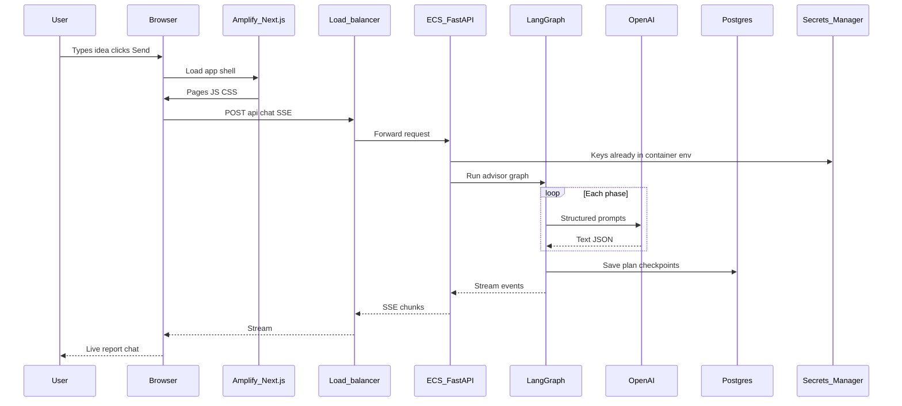
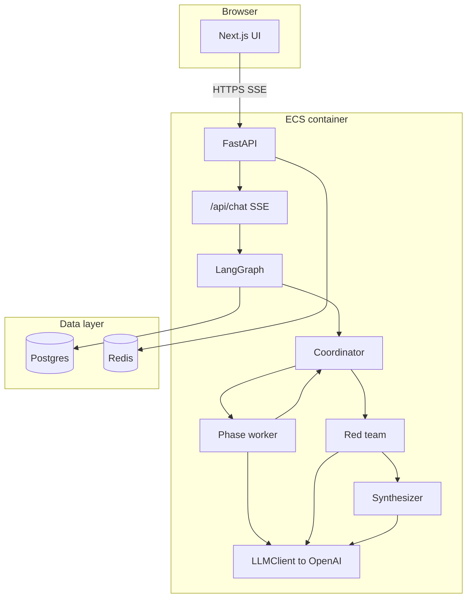

# How the application works—and how it connects to the infrastructure

**Audience:** Product owners, new teammates, and anyone who wants a story-like explanation of **what the app does** and **how it rides on top of AWS**.

This pairs with [`INFRASTRUCTURE_EXPLAINED.md`](INFRASTRUCTURE_EXPLAINED.md), which focuses on **cloud boxes**. Here we focus on **user journey**, **software flow**, and **how infra and app work together**.

---

## Two “faces” of the system

| Face | Technology | Lives in AWS as |
|------|------------|-----------------|
| **Website** | Next.js (React) | **Amplify** — pages, navigation, buttons |
| **Brain API** | Python FastAPI + LangGraph | **ECS Fargate** — behind **ALB** |

They talk over **HTTPS**: the website calls the API using a **public base URL** stored as **`NEXT_PUBLIC_API_URL`** at build time for Amplify.

**Note:** This repository does **not** use a variable named `NEXT_PUBLIC_APP_URL`. The **canonical URL of your web app** is usually Amplify’s default domain or a **custom domain** you add in Amplify. What we explicitly set for builds is **`NEXT_PUBLIC_API_URL`** so the browser knows **where the API lives** (the load balancer URL or your later `https://api...` domain).

---

## Diagram: from user click to answer

---

## What the product does (non-technical)

1. The user describes a **software or AI product idea** in plain language.
2. The system runs a **multi-step “advisor”** that breaks work into **phases** (for example: is the idea viable, architecture, tools, infrastructure, cost, security, etc.).
3. Along the way it may ask **clarifying questions**, run a **red team** critique, and end with a **structured plan** the user can read and export.
4. Progress can be **streamed** to the browser so the user sees updates as they happen.

---

## How the frontend works (Amplify + Next.js)

- **Amplify** hosts the built Next.js app.
- Important env vars for the **build** (set in Amplify / Terraform) include:
  - **`NEXT_PUBLIC_API_URL`** — base URL for all browser calls to your API (must point at your **ALB** or future API domain).
  - **`NEXT_PUBLIC_CLERK_PUBLISHABLE_KEY`** (if you use Clerk) — safe to expose in the browser; **not** the secret key.
- **Clerk’s secret key** for server-side auth can be supplied to Amplify from **Secrets Manager** in Terraform so server components or SSR can validate users—**never** put that secret in `NEXT_PUBLIC_*`.

When the user submits a chat, the frontend opens a **streaming connection** (Server-Sent Events) to **`/api/chat`** on the API URL. That is why the API must be reachable from the user’s browser (CORS and correct `NEXT_PUBLIC_API_URL`).

---

## How the backend works (ECS + FastAPI)

Inside each **ECS task**:

1. **FastAPI** receives HTTP requests.
2. **`/api/chat`** runs a **LangGraph** “state machine”: nodes such as **coordinator**, **phase_worker**, **red_team**, **synthesizer**, etc.
3. Every serious call to the AI goes through **one** module, **`LLMClient`**, which talks to **OpenAI** with guardrails (timeouts, retries, cost caps).
4. **Postgres** stores plans, users, spend, and **checkpoints** so long conversations can resume.
5. **Redis** supports rate limiting and similar fast operations.
6. **Structured logging** goes to CloudWatch; **optional Sentry** catches errors; **optional LangSmith** can trace LLM calls when configured.

So: **infrastructure** gives you a **stable place to run** the container; **application code** decides **what happens** inside that container.

---

## Diagram: LangGraph inside the API (simplified)

The graph **loops** through phases until the plan is complete or the user must answer questions. That is why one `/api/chat` session can last a while and **stream** many events.

---

## How infrastructure and application connect (cheat sheet)

| App need | Infra piece |
|----------|-------------|
| Run Python API 24/7 | **ECS Fargate** + **ALB** |
| Hide database from internet | **Private subnets** + **RDS** |
| Fast session/rate data | **Redis** in VPC |
| Keep PDFs off the app server | **S3** + IAM role on the task |
| Call OpenAI / Tavily | **NAT Gateway** outbound + **Secrets Manager** keys |
| Ship new backend code | **ECR** image + **GitHub Actions** deploy |
| Ship frontend | **Amplify** build from Git |
| HTTPS for API | **ACM** cert + ALB listener (after DNS validation) |

---

## End-to-end story (one paragraph)

A person opens your **Amplify** site, which was built from your **GitHub** repo. Their browser loads **JavaScript** that knows **`NEXT_PUBLIC_API_URL`**. When they start a plan, the browser opens a **streaming connection** to your **load balancer**, which sends traffic to a **healthy ECS task** running **FastAPI**. That task uses **keys from Secrets Manager**, runs the **LangGraph** advisor, reads and writes **Postgres** (and sometimes **Redis**), may call **OpenAI** and **Tavily** over the internet via **NAT**, and streams results back through the same path until the user sees a finished **plan**—with logs in **CloudWatch** and optional **Sentry** / **LangSmith** for operations.

---

## Related reading

- Cloud-focused overview: [`INFRASTRUCTURE_EXPLAINED.md`](INFRASTRUCTURE_EXPLAINED.md)
- Backend details for developers: [`../backend/ARCHITECTURE.md`](../backend/ARCHITECTURE.md)
- Bring-up steps: [`SETUP_GUIDE.md`](SETUP_GUIDE.md)
