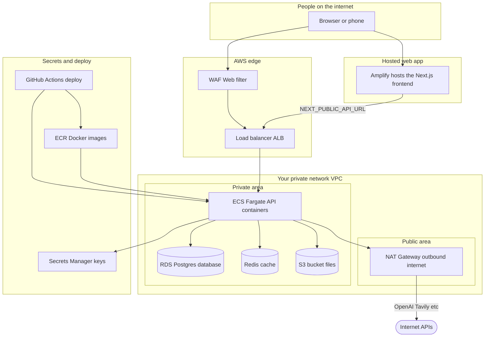

# How the cloud infrastructure fits together

**Audience:** Anyone who wants the big picture without reading Terraform or AWS manuals.

This document describes **what runs in AWS**, **how pieces connect**, and **why each piece exists** for the AI Build Advisor (B4Build) project.

---

## One sentence summary

Your **website** is hosted on **Amplify**, your **API brain** runs in **containers on Fargate** behind a **load balancer**, your **database and cache** live in **private subnets**, and **secrets** (API keys) are stored in **Secrets Manager**—not in code.

---

## Diagram: the bird’s-eye view

---

## What each layer does (in plain English)

### 1. Users and the internet

People open a **web address**. Two important URLs exist in this project:

| What | Typical role |
|------|----------------|
| **Amplify URL** | Where the **React/Next.js website** is served (pages, buttons, styling). Think “the storefront.” |
| **API URL** (`NEXT_PUBLIC_API_URL`) | Where the **browser sends questions** to your backend (the “brain”). In Terraform this points at the **load balancer** in front of your API. |

There is **no** `NEXT_PUBLIC_APP_URL` in Secrets Manager or in Amplify Terraform in this repo on purpose. The **app’s own site URL** is whatever Amplify assigns (for example `main.xxxxx.amplifyapp.com`) or a **custom domain** you attach in the Amplify console. The variable we **do** wire for builds is **`NEXT_PUBLIC_API_URL`**—that’s “which server answers `/api/...` calls.”

---

### 2. Amplify (the website host)

**Amplify** builds your **frontend** from GitHub (install packages, run `pnpm build`) and hosts the static/runtime output.

- It is **separate** from the API containers: changing frontend code does not redeploy the backend unless you trigger that workflow separately.
- Build settings come from **`amplify.yml`** at the repo root and Terraform’s **Amplify app** resource.

---

### 3. WAF + Application Load Balancer (ALB)

Traffic that hits your **API** first goes through:

- **WAF (Web Application Firewall)** — optional rules to block bad bots and common attacks before they reach your app.
- **ALB** — distributes requests across **healthy** API containers and checks **health** (for example `/health`) so broken containers are not sent traffic.

Think of the ALB as a **reception desk** that only sends visitors to workers who are actually ready.

---

### 4. ECS Fargate (where the Python API runs)

**ECS** runs your **Docker** image (built from `backend/`). **Fargate** means AWS runs the containers—you don’t manage EC2 servers yourself.

The container runs **FastAPI** (Python), which exposes `/api/chat`, `/api/plans`, `/health`, etc.

Containers sit in **private subnets**: they are not directly exposed to the internet except through the load balancer.

---

### 5. NAT Gateway

Containers need **outbound** internet to talk to **OpenAI**, **Tavily**, **pull images**, etc. Private subnets don’t have public IPs, so traffic exits through a **NAT Gateway** in a public subnet.

This is a normal AWS pattern; it has a monthly cost but avoids putting your database on the public internet.

---

### 6. RDS (Postgres)

The **database** stores durable things: users, plans, conversation checkpoints, spend tracking, etc.

It lives in the **private** network only: only your API (and migration jobs you run inside the same VPC) can reach it.

---

### 7. Redis (ElastiCache)

**Redis** is used for fast, temporary storage (rate limiting, caching patterns). It is also **private**—same idea as RDS.

---

### 8. S3

**S3** holds files such as exported PDFs. The API uses IAM permissions (task role) to read/write **without** putting AWS keys in your Git repo.

---

### 9. Secrets Manager

API keys (**OpenAI**, **Tavily**, **Clerk**, **Sentry**, **LangSmith**, **database URL**, etc.) are stored as **secrets**.

At **container start**, ECS **injects** them as **environment variables** inside the running task. Your Python code reads them like normal config—never commit them to Git.

---

### 10. ECR + GitHub Actions

- **ECR** is the **private Docker registry** where each **backend image** is stored after `docker build`.
- **GitHub Actions** (with AWS login via **OIDC**) can **push** a new image and **roll** the ECS service so new code goes live.

Terraform in **`infra/shared`** wires the **trust** between GitHub and AWS so CI/CD does not need long-lived AWS keys in GitHub if set up correctly.

---

### 11. Terraform state (S3 + lock)

Infrastructure is described in **Terraform** (`infra/shared`, `infra/envs/dev`). The **state file** (what was created) lives in **S3**, often with a **DynamoDB lock** so two people don’t apply at once.

This is **not** your product data—it’s **how AWS resources are tracked**.

---

## How a typical request travels (infrastructure only)

1. User loads the **Amplify** site (HTML/JS).
2. The browser calls **`NEXT_PUBLIC_API_URL`** (your ALB) for API requests.
3. **WAF → ALB → ECS task** receives the HTTP request.
4. The task may read **Secrets Manager** values that were mounted as env vars at start.
5. The task talks to **Postgres** / **Redis** / **S3** inside the VPC and to **external APIs** via **NAT**.

---

## What you configure vs what Terraform creates

| You fill in (after apply) | Terraform creates |
|---------------------------|-------------------|
| Real secret values in **Secrets Manager** | VPC, subnets, NAT, ALB, WAF, ECS service, RDS, Redis, S3, Amplify **app shell** |
| **Amplify:** connect Git branch in console | ECR repo, IAM roles, secret **containers** (names only) |
| Optional **DNS** CNAMEs for HTTPS certificate | ACM cert request, listeners |

---

## Related reading

- Step-by-step commands: [`SETUP_GUIDE.md`](SETUP_GUIDE.md)
- Terraform layout: [`../infra/README.md`](../infra/README.md)
- How the **software** inside the API works: [`APPLICATION_FLOW_EXPLAINED.md`](APPLICATION_FLOW_EXPLAINED.md)
