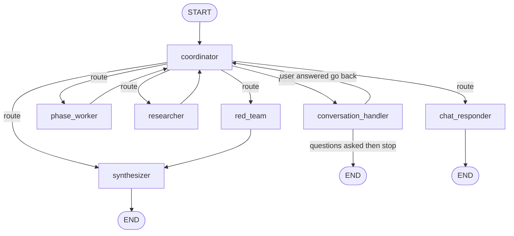
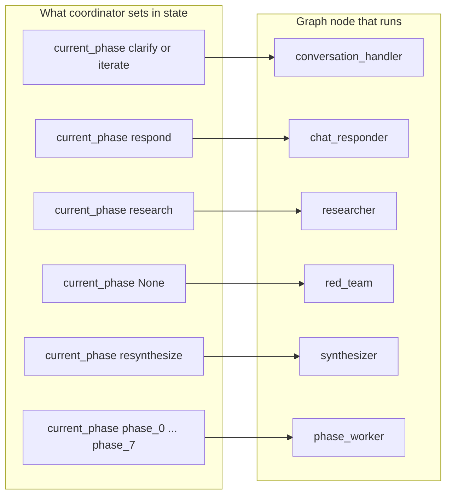
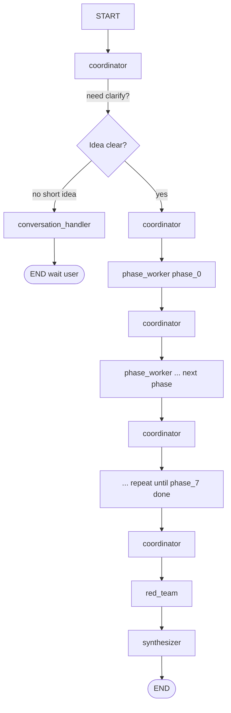

# LangGraph and the nine phases—how the “brain” is wired

**Audience:** Anyone who wants to see **how the advisor steps** line up with **LangGraph nodes**—without reading Python.

This document matches the real code in [`backend/src/graph/builder.py`](../backend/src/graph/builder.py), [`backend/src/graph/nodes/coordinator.py`](../backend/src/graph/nodes/coordinator.py), and [`backend/src/prompts/__init__.py`](../backend/src/prompts/__init__.py).

---

## What is LangGraph here?

**LangGraph** is a small **state machine**: boxes (**nodes**) connected by **arrows** (**edges**). Each node is a Python function that reads shared **state** (the user’s idea, outputs so far, metadata) and returns **updates** to that state.

- **One graph run** = one journey through those nodes until the graph hits **END**.
- The **coordinator** node does **not** call the AI to “decide” the next step in the simple case—it uses **rules** (which phase is missing next?).
- The **phase_worker** node **does** call the AI for each technical phase, using the right prompt and schema for that phase.

Think of LangGraph as a **workflow diagram** that the engine executes for you.

---

## The nine plan phases (order is fixed in code)

These are the **technical IDs** and the **titles** users see in the product. They always run in this **order** for a full new plan (unless the session stops early for clarifying questions):

| Order | Phase ID | What it’s about (plain English) |
|------:|----------|----------------------------------|
| 1 | `phase_0` | **Pressure test** — Is the idea clear enough and worth building? |
| 2 | `phase_1` | **Problem–model fit** — Is an LLM / AI approach the right tool? |
| 3 | `phase_2` | **Architecture** — Components, data flow, major technical choices. |
| 4 | `phase_3` | **Tools & open source** — Libraries, APIs, GitHub-style scouting. |
| 5 | `phase_4` | **Infrastructure** — Hosting, DB, queues, MVP vs production picture. |
| 6 | `phase_5` | **Cost model** — Money story: line items, scenarios, drivers. |
| 7 | `phase_6_25` | **Security & compliance** — Threats, mitigations, risks. |
| 8 | `phase_6_5` | **Observability** — Metrics, logs, tracing, alerts. |
| 9 | `phase_7` | **Scaling & resilience** — Bottlenecks and how to grow safely. |

After all nine outputs exist in state, the graph moves to **red team** (adversarial review) and then **synthesizer** (final assembled plan document)—see the big diagram below.

---

## Diagram A — Full graph shape (nodes and arrows)

This is the **topology** wired in `builder.py`: who can run after whom.

**How to read it**

- Everything starts at **coordinator**. The coordinator sets a **routing hint** in state (`current_phase`). A separate function **`coordinator_route`** picks **which node name** to run next.
- **phase_worker** always goes **back** to **coordinator** so the next missing phase can run—like a **loop** around the nine phases.
- **red_team → synthesizer → END** is the **finish line** for a full run: critique first, then one combined **plan** object.
- **conversation_handler** handles **clarifying questions** and **iteration** intents; it can **END** after questions or return to **coordinator**.
- **researcher** runs **before** certain heavy phases when the coordinator wants extra web context; then back to **coordinator**.
- **chat_responder** handles **chat / challenge** style messages when you already have a plan and ends the turn.

---

## Diagram B — How the coordinator picks the next box

The coordinator looks at **state** and sets **`current_phase`**. The router maps that to a **node**:

| `current_phase` value | Next node | Meaning |
|------------------------|-----------|---------|
| `clarify` or `iterate` | **conversation_handler** | Need questions or intent handling before / between phases |
| `respond` | **chat_responder** | User is chatting or challenging an existing plan |
| `research` | **researcher** | Extra lookup before **Infrastructure** or **Cost** when configured |
| `resynthesize` | **synthesizer** | Rebuild final plan after an edit pass |
| **`None`** (and not the iterate special cases) | **red_team** | All planned phases produced output → adversarial pass |
| `phase_0` … `phase_7` | **phase_worker** | Run the AI for that one phase |

---

## Diagram C — The “happy path” for a brand-new plan

Step-by-step story for **first-time generation** (no long chat branch):

So: **coordinator → phase_worker → coordinator** repeats until **nine** phase outputs are stored; then **coordinator** sets `current_phase` to **`None`**, which routes to **red_team**, then **synthesizer**, then **END**.

---

## Diagram D — The nine phases as a conveyor belt

Same order as `PHASE_ORDER` in code:

```mermaid
flowchart LR
  P0[phase_0 Pressure test] --> P1[phase_1 Problem-model fit]
  P1 --> P2[phase_2 Architecture]
  P2 --> P3[phase_3 Tools and OSS]
  P3 --> P4[phase_4 Infrastructure]
  P4 --> P5[phase_5 Cost model]
  P5 --> P625[phase_6_25 Security]
  P625 --> P65[phase_6_5 Observability]
  P65 --> P7[phase_7 Scaling]
```

Each step is **one** pass through **phase_worker** for that ID. The **coordinator** picks the **first missing** phase in this list (unless you use a custom `active_phase_order` in metadata).

---

## Special paths (still in the same graph)

1. **Clarifying questions**  
   If the idea is too thin, the coordinator sets **`clarify`**. **conversation_handler** asks questions and may **END** so the user can answer in the **next** HTTP/SSE request.

2. **Researcher before Infrastructure / Cost**  
   For **`phase_4`** and **`phase_5`**, the coordinator can route to **researcher** first (web context), then return to the coordinator so **phase_worker** runs the real phase.

3. **After the plan exists**  
   If there is already a **final plan**, the coordinator can route to **iterate** / **respond** / **resynthesize** so users can **chat**, **challenge**, or apply **edits** without starting from scratch—those paths use **conversation_handler**, **chat_responder**, or **synthesizer** as above.

---

## How this connects to what you see in the UI

- Each time **phase_worker** finishes a phase, the backend can **stream events** (e.g. phase start / phase complete) to the browser.
- The **report panel** tabs (P0–P7, synthesis, red team) reflect the same **phase IDs** and titles, mapped to friendly labels in the frontend.

---

## Where to read the real code

| Topic | File |
|-------|------|
| Graph wiring | [`backend/src/graph/builder.py`](../backend/src/graph/builder.py) |
| Routing rules | [`backend/src/graph/nodes/coordinator.py`](../backend/src/graph/nodes/coordinator.py) |
| Phase list & prompts | [`backend/src/prompts/__init__.py`](../backend/src/prompts/__init__.py) |
| One phase = one LLM call shape | [`backend/src/graph/nodes/phase_worker.py`](../backend/src/graph/nodes/phase_worker.py) |

---

## Related docs

- High-level app + infra story: [`APPLICATION_FLOW_EXPLAINED.md`](APPLICATION_FLOW_EXPLAINED.md)
- AWS topology: [`INFRASTRUCTURE_EXPLAINED.md`](INFRASTRUCTURE_EXPLAINED.md)
- Developer-deep backend notes: [`../backend/ARCHITECTURE.md`](../backend/ARCHITECTURE.md)
