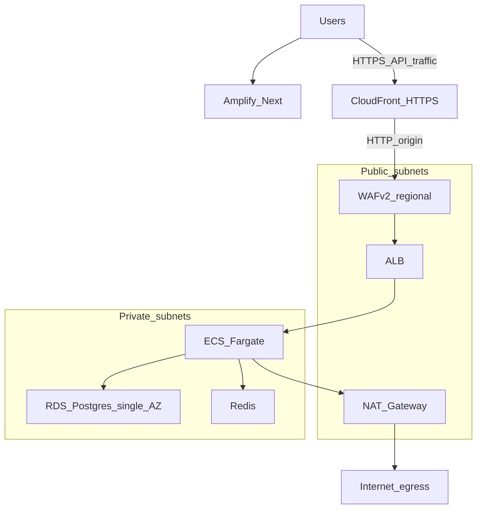

# Architecture (high level)

- **Egress:** Private workloads use a **single NAT Gateway** (cost control) in the VPC module, not a NAT instance.
- **UI:** **Amplify** serves the **Next.js** `frontend/`. `NEXT_PUBLIC_API_URL` points the browser at the **CloudFront** distribution (default), which uses the AWS-managed `*.cloudfront.net` cert and forwards HTTP to the ALB. Falls back to the ALB directly when a custom `api_fqdn` + ACM are configured.
- **API ingress:** Browser → **CloudFront** (HTTPS) → **WAF** (regional) → **ALB** → Fargate in private subnets.
- **CORS:** `var.cors_allow_origins` is wired to the ECS task as `CORS_ALLOW_ORIGINS` (JSON-encoded list) and consumed by FastAPI `CORSMiddleware`. `allow_credentials=True`, so wildcards are not allowed.
- **Data:** **RDS** and **Redis** only allow the **Fargate security group** on database ports; **S3** is private (task role for object access).
- **Secrets:** API keys and `DATABASE_URL` are in **Secrets Manager** and mounted via ECS `secrets` (not plaintext in the task definition for those values).

For bootstrap order (S3 state before `init`), see [README.md](README.md).
